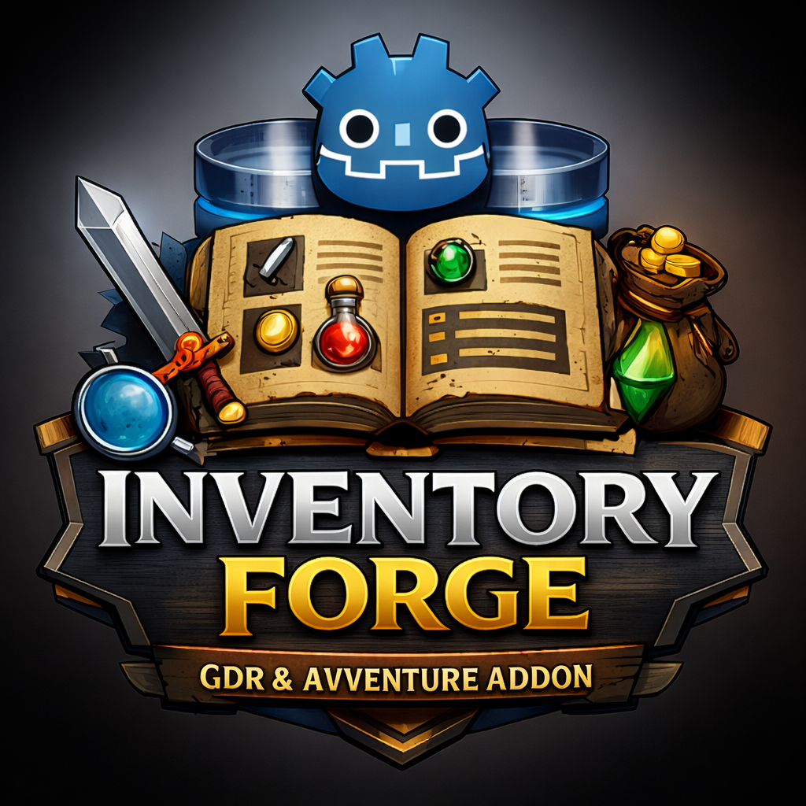
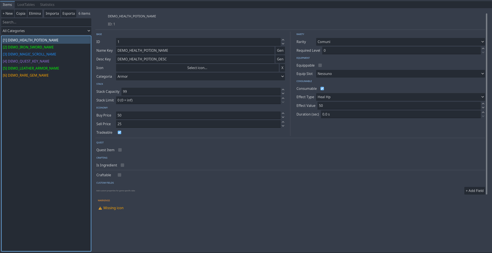

<p align="center">
  
</p>

# Inventory Forge - Item Database Editor for Godot 4.x

**Visual item database editor with multilingual support for RPG and adventure games**

Created by **Menkos** | License: MIT | Version: 1.2.0

---

## Features

- **Visual Item Editor** - Create and manage items directly in Godot Editor
- **Multilingual Support** - Translation keys with Godot's TranslationServer
- **Loot Tables** - Weighted drop system with rarity presets and sub-tables
- **Crafting System** - Ingredients, material types, and recipe management
- **Statistics Dashboard** - Real-time analytics for items and loot tables
- **Import/Export** - JSON and CSV support for both items and loot tables
- **Icon Picker** - Visual icon selection with folder scanning
- **Custom Fields** - User-defined properties per item
- **Validation** - Automatic warnings for missing or invalid data
- **Completely Standalone** - No external dependencies!

<p align="center">
  
</p>

---

## Installation

### From Godot AssetLib

1. Open Godot Editor → **AssetLib** tab
2. Search for "Inventory Forge"
3. Click **Download** and **Install**
4. Enable in **Project → Project Settings → Plugins**

### Manual Installation

1. Download the latest release from GitHub
2. Copy `addons/inventory_forge` to your project's `addons/` directory
3. Enable in **Project → Project Settings → Plugins**

---

## Quick Start

1. **Enable the Plugin** in Project Settings → Plugins
2. **Open the Editor** via the "Inventory Forge" tab in the top bar
3. **Create an Item** by clicking "+ Nuovo" (New)
4. **Fill in Details**: Name Key, Description Key, Icon, Category
5. **Changes save automatically!**

### Basic Usage in Code

```gdscript
# Load the database
var database: ItemDatabase = load("res://data/items/item_database.tres")

# Get an item
var potion = database.get_item_by_id(1)
print(potion.get_translated_name())

# Roll loot
var loot_db: LootTableDatabase = load("res://data/loot_database.tres")
var result = loot_db.roll_table_full("chest_common")
for drop in result.items:
    print("Dropped: %s x%d" % [drop.item.get_translated_name(), drop.quantity])
```

---

## Documentation

For detailed documentation, see **[DOCUMENTATION.md](DOCUMENTATION.md)**:

- Translation Setup
- Item Properties Reference
- Loot Tables Guide
- Import/Export Formats
- Troubleshooting

---

## Demo

The plugin includes a demo in `addons/inventory_forge/demo/`:

- **demo_database.tres** - Example database with 6 items
- **demo_translations.csv** - Example translations (EN/IT)
- **demo_items.gd** - Example usage script

---

## Roadmap

### Completed (v1.2.0)
- [x] Visual icon picker
- [x] Import/Export (JSON/CSV)
- [x] Loot tables with rarity presets
- [x] Sub-tables system
- [x] Crafting with ingredients
- [x] Statistics dashboard
- [x] Custom fields
- [x] Unit tests

### Planned
- [ ] Item templates/presets
- [ ] Item set bonuses
- [ ] Undo/Redo support
- [ ] Keyboard shortcuts

---

## Changelog

### 1.2.0 (2025-01-03)
- Statistics Dashboard for Items and Loot Tables
- Icon Picker with folder scanning and rescan
- Import/Export for Items and Loot Tables (JSON/CSV)
- Loot Tables with Rarity Presets and Sub-Tables
- Custom Fields with typed getters
- Enhanced Crafting with material types
- Unit Tests (GUT framework)

### 1.0.0 (2024-12-30)
- Initial release

---

## Contributing

Contributions welcome! Please:
1. Fork the repository
2. Create a feature branch
3. Submit a Pull Request

**Bug Reports:** Open an issue with Godot version, steps to reproduce, and expected vs actual behavior.

---

## Development

This plugin was developed with the assistance of AI tools (Claude/ChatGPT) for code review, debugging, and documentation. The core design, architecture, and implementation are human-crafted.

---

## License

MIT License - See [LICENSE](LICENSE)

**Created by Menkos** | Made with love for the Godot community
